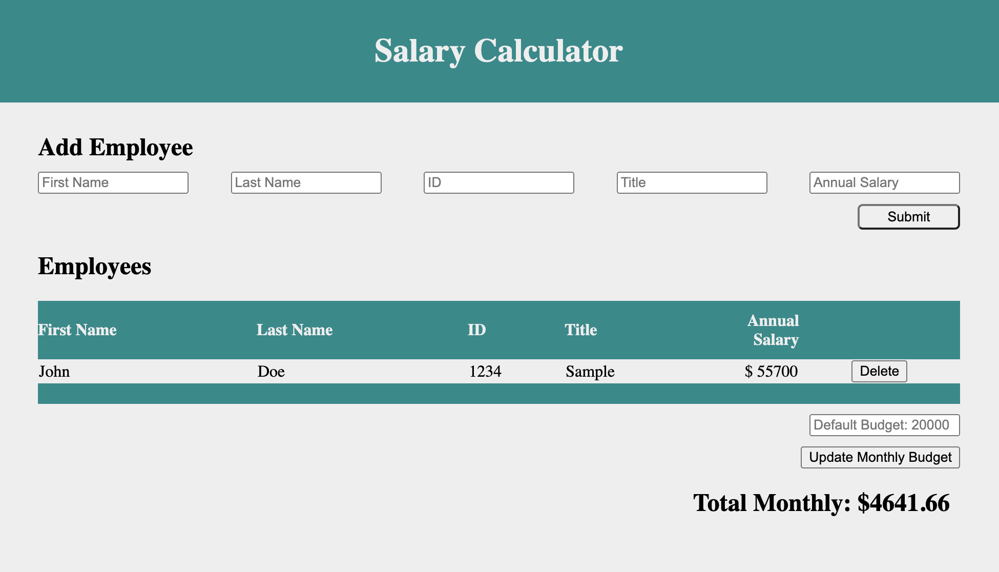

# Weekend Challenge: jQuery Salary Calculator
Create an application that records employee salaries and adds salaries up to report monthly costs. 

## Description
_Duration: 2-Day weekend sprint_

Need to calculate the monthly salary cost of all of your employees? Maybe it is review season and you need to stay under budget when considering raises? Look no further!

Here you can input your employee information and get a total monthly salary cost at the end. Want to change employee information you already input? Use the delete button to remove the employee from your list and calculation. Want to change your monthly budget? A field is provided to update that information.

[Deployed version of app](https://venomidas.github.io/weekend-jquery-salary-calculator/)

## Wireframe

## Screenshot

## Built With

1. HTML
2. CSS
3. Javascript
4. jQuery

## Acknowledgement
Thanks to [Prime Digital Academy](www.primeacademy.io) and members of the Phrygian cohort who equipped and helped me to make this application a reality.

## Support
If you have suggestions or issues, please email me at [schuma1022@gmail.com](schuma1022@gmail.com)

### Project Checklist
#### Initial Project Planning
- [X] Update README with instructions
- [X] Add project checklist to README
#### Initial File Setup and Sourcing
- [X] Create index.html
- [X] Create and source style.css
- [X] Create and source client.js
- [X] Create and source jquery.js
#### Base Mode Assignment Goals
- [X] Create header
- [X] Create an input form that collects employee...
- [X] first name
- [X] last name
- [X] ID number
- [X] job title
- [X] annual salary
- [X] Create a 'Submit' button 
- [X] Create a sample table to display employee information
- [X] Create Total Monthly Cost footer
- [X] Create an empty array to store the employee objects in
- [X] Collect the form information about the employee and store it
- [X] Append the employee information to the DOM
- [X] Empty the input fields
- [X] Use stored info to calculate monthly costs and append to the DOM
- [X] Change background to the total monthly cost to red if monthly cost exceeds $20,000
- [X] Create a 'Delete' button to remove an employee from the DOM (for base mode does not need to remove salary)
- [X] Update README description
#### Stretch Goals
- [X] Add styling or extra functionality that fits with the theme of this assignment.
- [X] Update the _Total Monthly Cost_ section on the page to reflect the employee's removal.
#### Other Thoughts
- [X] Host demo page with github pages
- [X] Add Link in README description to hosted demo page
- [X] Add favicon
- [X] Update wireframe with own screenshot
- [X] Submit assignment
- [ ] Test support link
- [ ] Add license